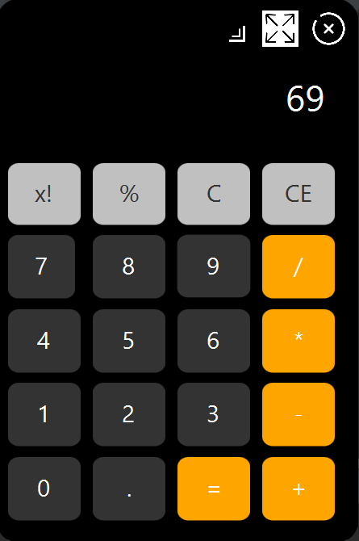

# JavaFX-Calculator
Simple Calculator with Apple's design

## Description

This calculator application is built using JavaFX and is designed to emulate the look and functionality of the Apple calculator.

## Features

- **Basic Arithmetic Operations:** Perform addition, subtraction, multiplication, and division.

- **Apple-Inspired Design:** The user interface is designed to resemble the Apple calculator.

## Getting Started

### Prerequisites

- Java Development Kit (JDK) installed
- [Other dependencies...]

### Installation

1. Clone the repository:

   ```bash git clone https://github.com/adamhitzger/JavaFX-Calculator.git


